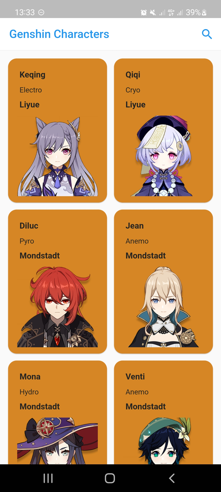
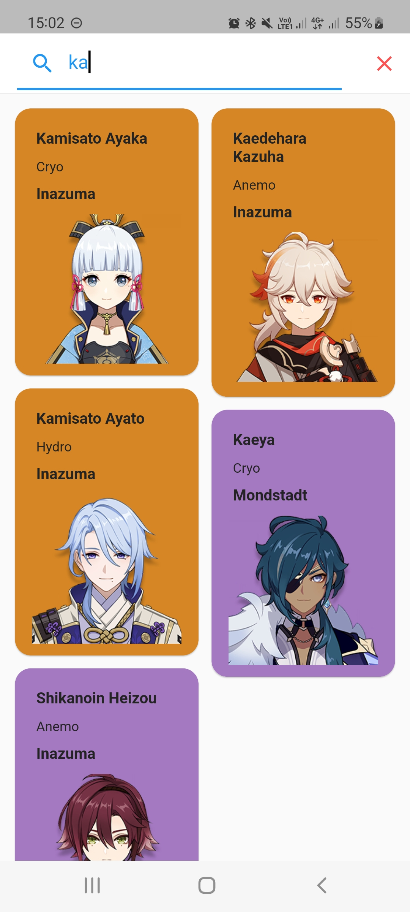
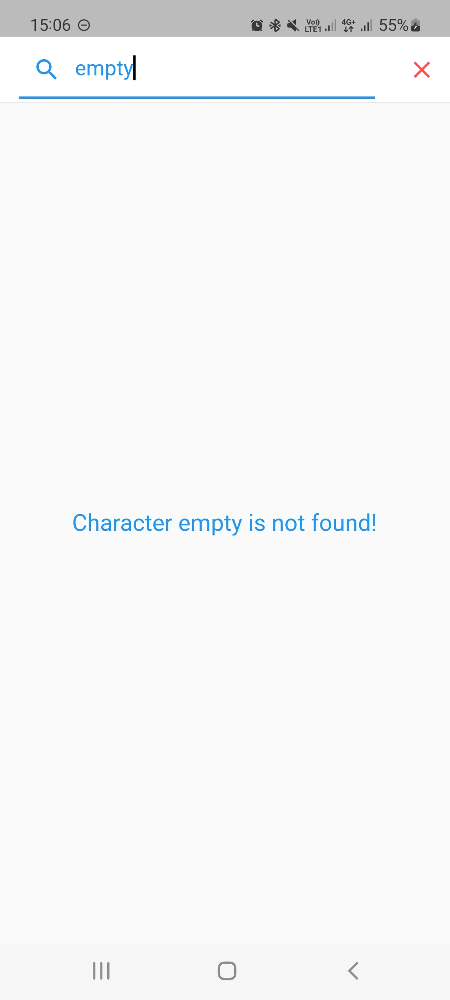
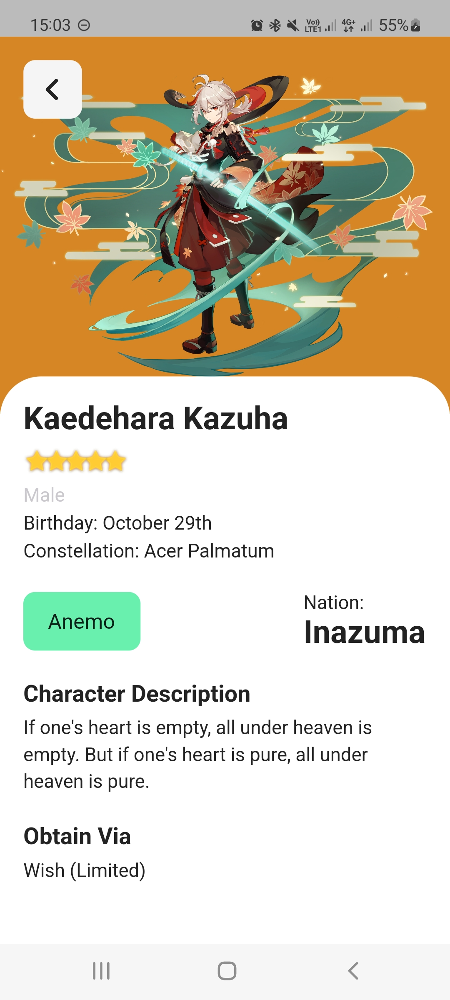

# genshin_characters

An app that shows list and details of all characters in Genshin Impact.
Besides, you also able to search specific character's name.
This app was made to be my material while learning Flutter Development. 
This app also proposed to be my submission file in the online course entitled "Belajar Membuat Aplikasi Flutter untuk Pemula" at Dicoding.com

## Features
- List of characters. Showing their photos, name, etc.
- Search any specific name you want.
- Detail of chosen character.

| Characters List                                    | Search Character                                     | Empty Search Result                                        | Character's Detail                                   |
|----------------------------------------------------|------------------------------------------------------|------------------------------------------------------------|------------------------------------------------------|
|  |  |  |  |

## Data Stream
This simple app retrieve the data from the locally stored .json file. But the internet connection is required to retrieve images from the network.

## References
All the characters' data and assets was referred from the [Genshin Impact Fandom Wiki](https://genshin-impact.fandom.com/wiki/) website.

## Creator
<table>
  <tbody>
    <tr>
      <td align="center" valign="top">
        
         
        <a href="https://github.com/syakirarif">Muhammad Syakir Arif</a>
        
UID: 801455838

      </td>
    </tr>
  </tbody>
</table>
